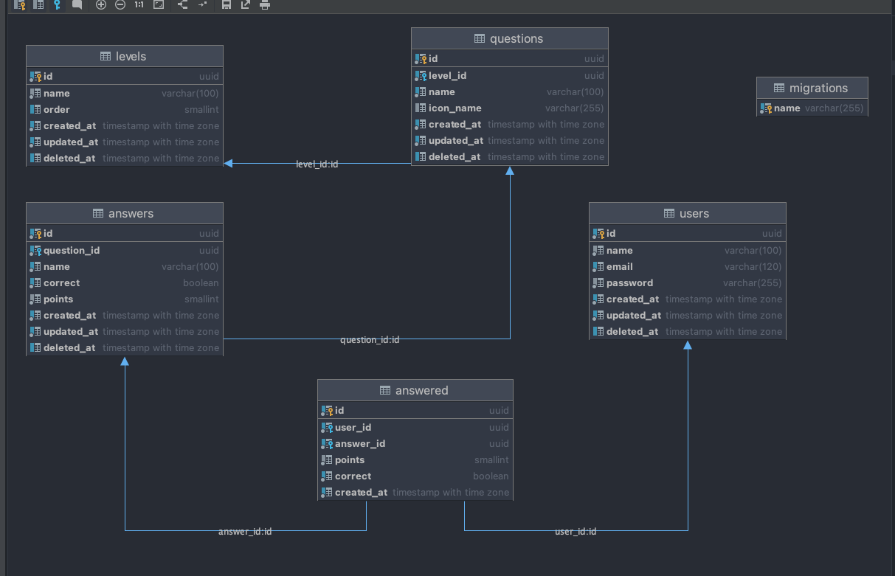
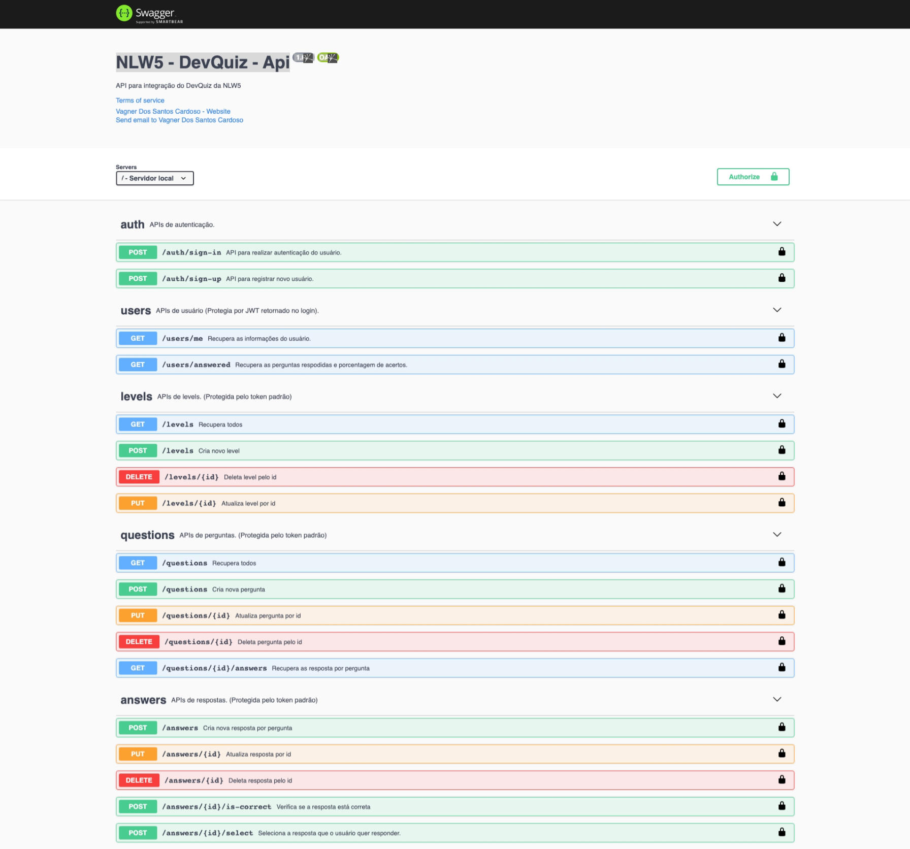

<h1 align="center">NLW5 - DevQuiz - API</h1>

<p align="center">
  
</p>

# Projeto

Projeto tem como objetivo integrar o app desenvolvido em [Flutter](https://flutter.dev/) durante a NLW5
da [Rocketseat](https://rocketseat.com.br), evento voltado a te levar ao próximo nível como desenvolvedor.

# Tecnologias

- [Express](https://expressjs.com/pt-br/)
- [TypeScript](https://www.typescriptlang.org/)
- [PostgreSQL](https://www.postgresql.org/)

# Pré requisitos para rodar o projeto.

- Node v14
  - npm ou yarn
- Docker

# Configurando o projeto

```shell
# Clonar o projeto
git clone git@github.com:vagnercardosoweb/nlw5-devquiz-api.git

# Entra na pasta do projeto
cd nlw5-devquiz-api
```

Agora você deve configurar as variável de ambiente.

- Copie o `.env.example` pra `.env`
- Configure as variávies, caso esteja utilizando docker o banco já está configurado para rodar local.
- Cria duas chaves seguras e mude em `APP_KEY` e `API_KEY`.
- Caso queira o rastreamento do [sentry](https://sentry.io/welcome/), você deve configurar o `SENTRY_DSN`.

**APP_KEY**: chave para proteger a criptografia do token JWT.

**API_KEY**: chave para proteger as chamadas as apis quando não tem um token do usuário (JWT).

# Rodando o projeto

```shell
# Ligando o projeto
yarn dev:docker

## caso esteja utilizando npm:
npm run dev:docker

# Rodando as migrations
docker exec nlw5-devquiz-api sh -c "yarn db:migrate"
```

# Documentação da API

A documentação pode ser acessada atrávez [http://localhost:3333/docs](http://localhost:3333/docs)

<p align="center">
  
</p>

## Licença

Esse projeto está sob a licença MIT. Veja o arquivo [LICENSE](LICENSE.md) para mais detalhes.

---

Feito com ♥ by Vagner Cardoso
